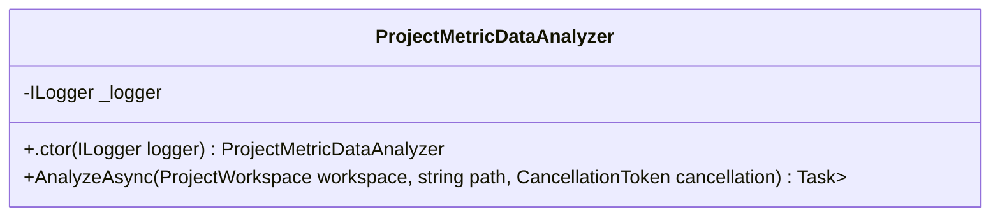
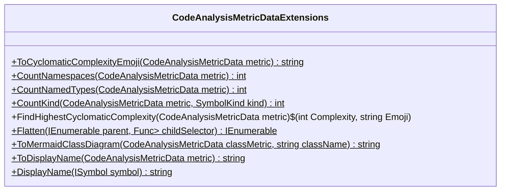
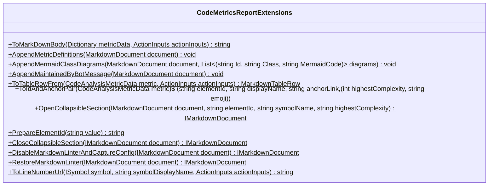
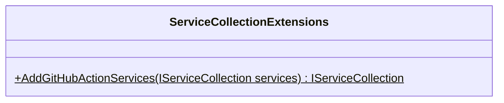
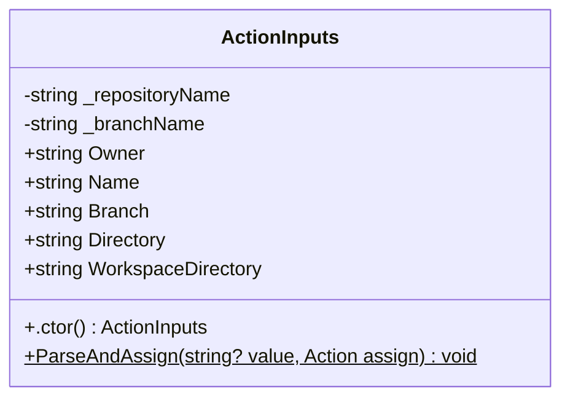

<!-- markdownlint-capture -->
<!-- markdownlint-disable -->

# Code Metrics

This file is dynamically maintained by a bot, *please do not* edit this by hand. It represents various [code metrics](https://aka.ms/dotnet/code-metrics), such as cyclomatic complexity, maintainability index, and so on.

## DotNet.GitHubAction :x:

The *DotNet.GitHubAction.csproj* project file contains:

- 4 namespaces.
- 6 named types.
- 669 total lines of source code.
- Approximately 288 lines of executable code.
- The highest cyclomatic complexity is 13 :x:.

  <strong id="global+namespace">
    &lt;global namespace&gt; :heavy_check_mark:
  </strong>

 

The `<global namespace>` namespace contains 1 named types.

- 1 named types.
- 94 total lines of source code.
- Approximately 94 lines of executable code.
- The highest cyclomatic complexity is 7 :heavy_check_mark:.

  <strong id="program$">
    &lt;Program&gt;$ :heavy_check_mark:
  </strong>

 

- The `<Program>$` contains 1 members.
- 94 total lines of source code.
- Approximately 94 lines of executable code.
- The highest cyclomatic complexity is 7 :heavy_check_mark:.

| Member kind | Line number | Maintainability index | Cyclomatic complexity | Depth of inheritance | Class coupling | Lines of source / executable code |
| :-: | :-: | :-: | :-: | :-: | :-: | :-: |
| Method | <a href='https://github.com/dliulabs/cs-github-actions/blob/main/Users/David/repo/github-enterprise/cs-github-actions/DotNet.GitHubAction/DotNet.GitHubAction/Program.cs#L1' title='<top-level-statements-entry-point>'>1</a> | 42 | 7 :heavy_check_mark: | 0 | 15 | 94 / 47 |

<a href="#global+namespace">:top: back to &lt;global namespace&gt;</a>

  <strong id="dotnet-githubaction-analyzers">
    DotNet.GitHubAction.Analyzers :heavy_check_mark:
  </strong>

 

The `DotNet.GitHubAction.Analyzers` namespace contains 1 named types.

- 1 named types.
- 47 total lines of source code.
- Approximately 13 lines of executable code.
- The highest cyclomatic complexity is 3 :heavy_check_mark:.

  <strong id="projectmetricdataanalyzer">
    ProjectMetricDataAnalyzer :heavy_check_mark:
  </strong>

 

- The `ProjectMetricDataAnalyzer` contains 3 members.
- 44 total lines of source code.
- Approximately 13 lines of executable code.
- The highest cyclomatic complexity is 3 :heavy_check_mark:.

| Member kind | Line number | Maintainability index | Cyclomatic complexity | Depth of inheritance | Class coupling | Lines of source / executable code |
| :-: | :-: | :-: | :-: | :-: | :-: | :-: |
| Field | <a href='https://github.com/dliulabs/cs-github-actions/blob/main/Users/David/repo/github-enterprise/cs-github-actions/DotNet.GitHubAction/DotNet.GitHubAction/Analyzers/ProjectMetricDataAnalyzer.cs#L7' title='ILogger<ProjectMetricDataAnalyzer> ProjectMetricDataAnalyzer._logger'>7</a> | 100 | 0 :heavy_check_mark: | 0 | 1 | 1 / 0 |
| Method | <a href='https://github.com/dliulabs/cs-github-actions/blob/main/Users/David/repo/github-enterprise/cs-github-actions/DotNet.GitHubAction/DotNet.GitHubAction/Analyzers/ProjectMetricDataAnalyzer.cs#L9' title='ProjectMetricDataAnalyzer.ProjectMetricDataAnalyzer(ILogger<ProjectMetricDataAnalyzer> logger)'>9</a> | 96 | 1 :heavy_check_mark: | 0 | 1 | 1 / 1 |
| Method | <a href='https://github.com/dliulabs/cs-github-actions/blob/main/Users/David/repo/github-enterprise/cs-github-actions/DotNet.GitHubAction/DotNet.GitHubAction/Analyzers/ProjectMetricDataAnalyzer.cs#L11' title='Task<ImmutableArray<(string, CodeAnalysisMetricData)>> ProjectMetricDataAnalyzer.AnalyzeAsync(ProjectWorkspace workspace, string path, CancellationToken cancellation)'>11</a> | 61 | 3 :heavy_check_mark: | 0 | 10 | 37 / 12 |

<a href="#ProjectMetricDataAnalyzer-class-diagram">:link: to `ProjectMetricDataAnalyzer` class diagram</a>

<a href="#dotnet-githubaction-analyzers">:top: back to DotNet.GitHubAction.Analyzers</a>

  <strong id="dotnet-githubaction-extensions">
    DotNet.GitHubAction.Extensions :x:
  </strong>

 

The `DotNet.GitHubAction.Extensions` namespace contains 3 named types.

- 3 named types.
- 471 total lines of source code.
- Approximately 156 lines of executable code.
- The highest cyclomatic complexity is 13 :x:.

  <strong id="codeanalysismetricdataextensions">
    CodeAnalysisMetricDataExtensions :x:
  </strong>

 

- The `CodeAnalysisMetricDataExtensions` contains 9 members.
- 208 total lines of source code.
- Approximately 67 lines of executable code.
- The highest cyclomatic complexity is 13 :x:.

| Member kind | Line number | Maintainability index | Cyclomatic complexity | Depth of inheritance | Class coupling | Lines of source / executable code |
| :-: | :-: | :-: | :-: | :-: | :-: | :-: |
| Method | <a href='https://github.com/dliulabs/cs-github-actions/blob/main/Users/David/repo/github-enterprise/cs-github-actions/DotNet.GitHubAction/DotNet.GitHubAction/Extensions/CodeAnalysisMetricDataExtensions.cs#L24' title='int CodeAnalysisMetricDataExtensions.CountKind(CodeAnalysisMetricData metric, SymbolKind kind)'>24</a> | 82 | 1 :heavy_check_mark: | 0 | 4 | 4 / 3 |
| Method | <a href='https://github.com/dliulabs/cs-github-actions/blob/main/Users/David/repo/github-enterprise/cs-github-actions/DotNet.GitHubAction/DotNet.GitHubAction/Extensions/CodeAnalysisMetricDataExtensions.cs#L21' title='int CodeAnalysisMetricDataExtensions.CountNamedTypes(CodeAnalysisMetricData metric)'>21</a> | 100 | 1 :heavy_check_mark: | 0 | 2 | 2 / 1 |
| Method | <a href='https://github.com/dliulabs/cs-github-actions/blob/main/Users/David/repo/github-enterprise/cs-github-actions/DotNet.GitHubAction/DotNet.GitHubAction/Extensions/CodeAnalysisMetricDataExtensions.cs#L18' title='int CodeAnalysisMetricDataExtensions.CountNamespaces(CodeAnalysisMetricData metric)'>18</a> | 100 | 1 :heavy_check_mark: | 0 | 2 | 2 / 1 |
| Method | <a href='https://github.com/dliulabs/cs-github-actions/blob/main/Users/David/repo/github-enterprise/cs-github-actions/DotNet.GitHubAction/DotNet.GitHubAction/Extensions/CodeAnalysisMetricDataExtensions.cs#L196' title='string CodeAnalysisMetricDataExtensions.DisplayName(ISymbol symbol)'>196</a> | 69 | 2 :heavy_check_mark: | 0 | 3 | 17 / 7 |
| Method | <a href='https://github.com/dliulabs/cs-github-actions/blob/main/Users/David/repo/github-enterprise/cs-github-actions/DotNet.GitHubAction/DotNet.GitHubAction/Extensions/CodeAnalysisMetricDataExtensions.cs#L29' title='(int Complexity, string Emoji) CodeAnalysisMetricDataExtensions.FindHighestCyclomaticComplexity(CodeAnalysisMetricData metric)'>29</a> | 73 | 1 :heavy_check_mark: | 0 | 4 | 12 / 6 |
| Method | <a href='https://github.com/dliulabs/cs-github-actions/blob/main/Users/David/repo/github-enterprise/cs-github-actions/DotNet.GitHubAction/DotNet.GitHubAction/Extensions/CodeAnalysisMetricDataExtensions.cs#L42' title='IEnumerable<TSource> CodeAnalysisMetricDataExtensions.Flatten<TSource>(IEnumerable<TSource> parent, Func<TSource, IEnumerable<TSource>> childSelector)'>42</a> | 87 | 1 :heavy_check_mark: | 0 | 3 | 5 / 2 |
| Method | <a href='https://github.com/dliulabs/cs-github-actions/blob/main/Users/David/repo/github-enterprise/cs-github-actions/DotNet.GitHubAction/DotNet.GitHubAction/Extensions/CodeAnalysisMetricDataExtensions.cs#L8' title='string CodeAnalysisMetricDataExtensions.ToCyclomaticComplexityEmoji(CodeAnalysisMetricData metric)'>8</a> | 88 | 1 :heavy_check_mark: | 0 | 2 | 9 / 1 |
| Method | <a href='https://github.com/dliulabs/cs-github-actions/blob/main/Users/David/repo/github-enterprise/cs-github-actions/DotNet.GitHubAction/DotNet.GitHubAction/Extensions/CodeAnalysisMetricDataExtensions.cs#L181' title='string CodeAnalysisMetricDataExtensions.ToDisplayName(CodeAnalysisMetricData metric)'>181</a> | 100 | 1 :heavy_check_mark: | 0 | 2 | 14 / 1 |
| Method | <a href='https://github.com/dliulabs/cs-github-actions/blob/main/Users/David/repo/github-enterprise/cs-github-actions/DotNet.GitHubAction/DotNet.GitHubAction/Extensions/CodeAnalysisMetricDataExtensions.cs#L48' title='string CodeAnalysisMetricDataExtensions.ToMermaidClassDiagram(CodeAnalysisMetricData classMetric, string className)'>48</a> | 41 | 13 :x: | 0 | 9 | 132 / 45 |

<a href="#CodeAnalysisMetricDataExtensions-class-diagram">:link: to `CodeAnalysisMetricDataExtensions` class diagram</a>

<a href="#dotnet-githubaction-extensions">:top: back to DotNet.GitHubAction.Extensions</a>

  <strong id="codemetricsreportextensions">
    CodeMetricsReportExtensions :heavy_check_mark:
  </strong>

 

- The `CodeMetricsReportExtensions` contains 12 members.
- 248 total lines of source code.
- Approximately 88 lines of executable code.
- The highest cyclomatic complexity is 6 :heavy_check_mark:.

| Member kind | Line number | Maintainability index | Cyclomatic complexity | Depth of inheritance | Class coupling | Lines of source / executable code |
| :-: | :-: | :-: | :-: | :-: | :-: | :-: |
| Method | <a href='https://github.com/dliulabs/cs-github-actions/blob/main/Users/David/repo/github-enterprise/cs-github-actions/DotNet.GitHubAction/DotNet.GitHubAction/Extensions/CodeMetricsReportExtensions.cs#L157' title='void CodeMetricsReportExtensions.AppendMaintainedByBotMessage(MarkdownDocument document)'>157</a> | 98 | 1 :heavy_check_mark: | 0 | 3 | 3 / 1 |
| Method | <a href='https://github.com/dliulabs/cs-github-actions/blob/main/Users/David/repo/github-enterprise/cs-github-actions/DotNet.GitHubAction/DotNet.GitHubAction/Extensions/CodeMetricsReportExtensions.cs#L144' title='void CodeMetricsReportExtensions.AppendMermaidClassDiagrams(MarkdownDocument document, List<(string Id, string Class, string MermaidCode)> diagrams)'>144</a> | 72 | 2 :heavy_check_mark: | 0 | 5 | 12 / 5 |
| Method | <a href='https://github.com/dliulabs/cs-github-actions/blob/main/Users/David/repo/github-enterprise/cs-github-actions/DotNet.GitHubAction/DotNet.GitHubAction/Extensions/CodeMetricsReportExtensions.cs#L119' title='void CodeMetricsReportExtensions.AppendMetricDefinitions(MarkdownDocument document)'>119</a> | 66 | 2 :heavy_check_mark: | 0 | 5 | 24 / 7 |
| Method | <a href='https://github.com/dliulabs/cs-github-actions/blob/main/Users/David/repo/github-enterprise/cs-github-actions/DotNet.GitHubAction/DotNet.GitHubAction/Extensions/CodeMetricsReportExtensions.cs#L214' title='IMarkdownDocument CodeMetricsReportExtensions.CloseCollapsibleSection(IMarkdownDocument document)'>214</a> | 98 | 1 :heavy_check_mark: | 0 | 2 | 2 / 1 |
| Method | <a href='https://github.com/dliulabs/cs-github-actions/blob/main/Users/David/repo/github-enterprise/cs-github-actions/DotNet.GitHubAction/DotNet.GitHubAction/Extensions/CodeMetricsReportExtensions.cs#L217' title='IMarkdownDocument CodeMetricsReportExtensions.DisableMarkdownLinterAndCaptureConfig(IMarkdownDocument document)'>217</a> | 98 | 1 :heavy_check_mark: | 0 | 2 | 4 / 1 |
| Method | <a href='https://github.com/dliulabs/cs-github-actions/blob/main/Users/David/repo/github-enterprise/cs-github-actions/DotNet.GitHubAction/DotNet.GitHubAction/Extensions/CodeMetricsReportExtensions.cs#L195' title='IMarkdownDocument CodeMetricsReportExtensions.OpenCollapsibleSection(IMarkdownDocument document, string elementId, string symbolName, string highestComplexity)'>195</a> | 91 | 1 :heavy_check_mark: | 0 | 2 | 9 / 1 |
| Method | <a href='https://github.com/dliulabs/cs-github-actions/blob/main/Users/David/repo/github-enterprise/cs-github-actions/DotNet.GitHubAction/DotNet.GitHubAction/Extensions/CodeMetricsReportExtensions.cs#L205' title='string CodeMetricsReportExtensions.PrepareElementId(string value)'>205</a> | 88 | 1 :heavy_check_mark: | 0 | 1 | 8 / 1 |
| Method | <a href='https://github.com/dliulabs/cs-github-actions/blob/main/Users/David/repo/github-enterprise/cs-github-actions/DotNet.GitHubAction/DotNet.GitHubAction/Extensions/CodeMetricsReportExtensions.cs#L222' title='IMarkdownDocument CodeMetricsReportExtensions.RestoreMarkdownLinter(IMarkdownDocument document)'>222</a> | 98 | 1 :heavy_check_mark: | 0 | 2 | 3 / 1 |
| Method | <a href='https://github.com/dliulabs/cs-github-actions/blob/main/Users/David/repo/github-enterprise/cs-github-actions/DotNet.GitHubAction/DotNet.GitHubAction/Extensions/CodeMetricsReportExtensions.cs#L184' title='(string elementId, string displayName, string anchorLink, (int highestComplexity, string emoji)) CodeMetricsReportExtensions.ToIdAndAnchorPair(CodeAnalysisMetricData metric)'>184</a> | 71 | 2 :heavy_check_mark: | 0 | 5 | 10 / 5 |
| Method | <a href='https://github.com/dliulabs/cs-github-actions/blob/main/Users/David/repo/github-enterprise/cs-github-actions/DotNet.GitHubAction/DotNet.GitHubAction/Extensions/CodeMetricsReportExtensions.cs#L226' title='string CodeMetricsReportExtensions.ToLineNumberUrl(ISymbol symbol, string symbolDisplayName, ActionInputs actionInputs)'>226</a> | 61 | 4 :heavy_check_mark: | 0 | 3 | 26 / 10 |
| Method | <a href='https://github.com/dliulabs/cs-github-actions/blob/main/Users/David/repo/github-enterprise/cs-github-actions/DotNet.GitHubAction/DotNet.GitHubAction/Extensions/CodeMetricsReportExtensions.cs#L7' title='string CodeMetricsReportExtensions.ToMarkDownBody(Dictionary<string, CodeAnalysisMetricData> metricData, ActionInputs actionInputs)'>7</a> | 42 | 6 :heavy_check_mark: | 0 | 15 | 111 / 47 |
| Method | <a href='https://github.com/dliulabs/cs-github-actions/blob/main/Users/David/repo/github-enterprise/cs-github-actions/DotNet.GitHubAction/DotNet.GitHubAction/Extensions/CodeMetricsReportExtensions.cs#L161' title='MarkdownTableRow CodeMetricsReportExtensions.ToTableRowFrom(CodeAnalysisMetricData metric, ActionInputs actionInputs)'>161</a> | 65 | 1 :heavy_check_mark: | 0 | 5 | 22 / 8 |

<a href="#CodeMetricsReportExtensions-class-diagram">:link: to `CodeMetricsReportExtensions` class diagram</a>

<a href="#dotnet-githubaction-extensions">:top: back to DotNet.GitHubAction.Extensions</a>

  <strong id="servicecollectionextensions">
    ServiceCollectionExtensions :heavy_check_mark:
  </strong>

 

- The `ServiceCollectionExtensions` contains 1 members.
- 7 total lines of source code.
- Approximately 1 lines of executable code.
- The highest cyclomatic complexity is 1 :heavy_check_mark:.

| Member kind | Line number | Maintainability index | Cyclomatic complexity | Depth of inheritance | Class coupling | Lines of source / executable code |
| :-: | :-: | :-: | :-: | :-: | :-: | :-: |
| Method | <a href='https://github.com/dliulabs/cs-github-actions/blob/main/Users/David/repo/github-enterprise/cs-github-actions/DotNet.GitHubAction/DotNet.GitHubAction/Extensions/ServiceCollectionExtensions.cs#L5' title='IServiceCollection ServiceCollectionExtensions.AddGitHubActionServices(IServiceCollection services)'>5</a> | 100 | 1 :heavy_check_mark: | 0 | 2 | 4 / 1 |

<a href="#ServiceCollectionExtensions-class-diagram">:link: to `ServiceCollectionExtensions` class diagram</a>

<a href="#dotnet-githubaction-extensions">:top: back to DotNet.GitHubAction.Extensions</a>

  <strong id="dotnet-githubaction">
    DotNet.GitHubAction :heavy_check_mark:
  </strong>

 

The `DotNet.GitHubAction` namespace contains 1 named types.

- 1 named types.
- 57 total lines of source code.
- Approximately 25 lines of executable code.
- The highest cyclomatic complexity is 3 :heavy_check_mark:.

  <strong id="actioninputs">
    ActionInputs :heavy_check_mark:
  </strong>

 

- The `ActionInputs` contains 9 members.
- 55 total lines of source code.
- Approximately 25 lines of executable code.
- The highest cyclomatic complexity is 3 :heavy_check_mark:.

| Member kind | Line number | Maintainability index | Cyclomatic complexity | Depth of inheritance | Class coupling | Lines of source / executable code |
| :-: | :-: | :-: | :-: | :-: | :-: | :-: |
| Field | <a href='https://github.com/dliulabs/cs-github-actions/blob/main/Users/David/repo/github-enterprise/cs-github-actions/DotNet.GitHubAction/DotNet.GitHubAction/ActionInputs.cs#L6' title='string ActionInputs._branchName'>6</a> | 93 | 0 :heavy_check_mark: | 0 | 0 | 1 / 1 |
| Field | <a href='https://github.com/dliulabs/cs-github-actions/blob/main/Users/David/repo/github-enterprise/cs-github-actions/DotNet.GitHubAction/DotNet.GitHubAction/ActionInputs.cs#L5' title='string ActionInputs._repositoryName'>5</a> | 93 | 0 :heavy_check_mark: | 0 | 0 | 1 / 1 |
| Method | <a href='https://github.com/dliulabs/cs-github-actions/blob/main/Users/David/repo/github-enterprise/cs-github-actions/DotNet.GitHubAction/DotNet.GitHubAction/ActionInputs.cs#L8' title='ActionInputs.ActionInputs()'>8</a> | 88 | 2 :heavy_check_mark: | 0 | 1 | 8 / 2 |
| Property | <a href='https://github.com/dliulabs/cs-github-actions/blob/main/Users/David/repo/github-enterprise/cs-github-actions/DotNet.GitHubAction/DotNet.GitHubAction/ActionInputs.cs#L34' title='string ActionInputs.Branch'>34</a> | 93 | 2 :heavy_check_mark: | 0 | 2 | 8 / 5 |
| Property | <a href='https://github.com/dliulabs/cs-github-actions/blob/main/Users/David/repo/github-enterprise/cs-github-actions/DotNet.GitHubAction/DotNet.GitHubAction/ActionInputs.cs#L43' title='string ActionInputs.Directory'>43</a> | 100 | 2 :heavy_check_mark: | 0 | 2 | 4 / 3 |
| Property | <a href='https://github.com/dliulabs/cs-github-actions/blob/main/Users/David/repo/github-enterprise/cs-github-actions/DotNet.GitHubAction/DotNet.GitHubAction/ActionInputs.cs#L25' title='string ActionInputs.Name'>25</a> | 93 | 2 :heavy_check_mark: | 0 | 2 | 8 / 5 |
| Property | <a href='https://github.com/dliulabs/cs-github-actions/blob/main/Users/David/repo/github-enterprise/cs-github-actions/DotNet.GitHubAction/DotNet.GitHubAction/ActionInputs.cs#L20' title='string ActionInputs.Owner'>20</a> | 100 | 2 :heavy_check_mark: | 0 | 2 | 4 / 3 |
| Method | <a href='https://github.com/dliulabs/cs-github-actions/blob/main/Users/David/repo/github-enterprise/cs-github-actions/DotNet.GitHubAction/DotNet.GitHubAction/ActionInputs.cs#L50' title='void ActionInputs.ParseAndAssign(string? value, Action<string> assign)'>50</a> | 82 | 3 :heavy_check_mark: | 0 | 4 | 7 / 2 |
| Property | <a href='https://github.com/dliulabs/cs-github-actions/blob/main/Users/David/repo/github-enterprise/cs-github-actions/DotNet.GitHubAction/DotNet.GitHubAction/ActionInputs.cs#L48' title='string ActionInputs.WorkspaceDirectory'>48</a> | 100 | 2 :heavy_check_mark: | 0 | 2 | 4 / 3 |

<a href="#ActionInputs-class-diagram">:link: to `ActionInputs` class diagram</a>

<a href="#dotnet-githubaction">:top: back to DotNet.GitHubAction</a>

<a href="#dotnet-githubaction">:top: back to DotNet.GitHubAction</a>

## Metric definitions

  - **Maintainability index**: Measures ease of code maintenance. Higher values are better.
  - **Cyclomatic complexity**: Measures the number of branches. Lower values are better.
  - **Depth of inheritance**: Measures length of object inheritance hierarchy. Lower values are better.
  - **Class coupling**: Measures the number of classes that are referenced. Lower values are better.
  - **Lines of source code**: Exact number of lines of source code. Lower values are better.
  - **Lines of executable code**: Approximates the lines of executable code. Lower values are better.

## Mermaid class diagrams

##### `ProjectMetricDataAnalyzer` class diagram

##### `CodeAnalysisMetricDataExtensions` class diagram

##### `CodeMetricsReportExtensions` class diagram

##### `ServiceCollectionExtensions` class diagram

##### `ActionInputs` class diagram

*This file is maintained by a bot.*

<!-- markdownlint-restore -->
